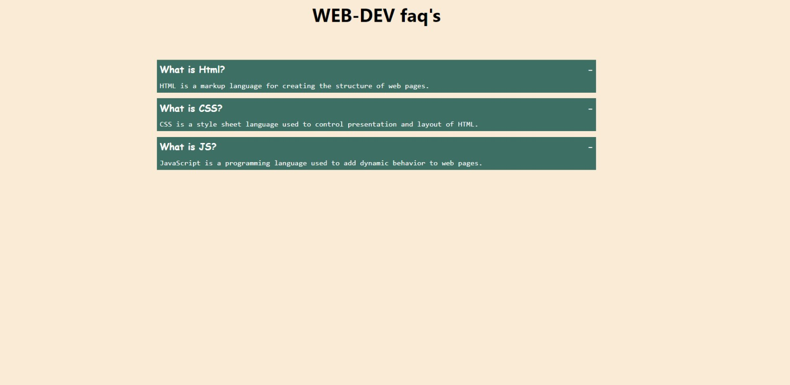

# Accordion FAQ

This is a simple accordion FAQ web page built using HTML, CSS, and JavaScript. It presents a list of questions and their corresponding answers in an interactive accordion format.

## Table of Contents

- [Demo](#demo)
- [Features](#features)
- [Technologies Used](#technologies-used)

## Demo

You can see a live demo of this project [here](https://siri-job.github.io/Accordion-repo/).

## Features

- Displays a list of questions and answers in an accordion format.
- Clicking on a question expands/collapses the corresponding answer.
- Stylish design with hover effects and responsive layout.

## Technologies Used

- HTML
- CSS
- JavaScript

## Screenshot
 
